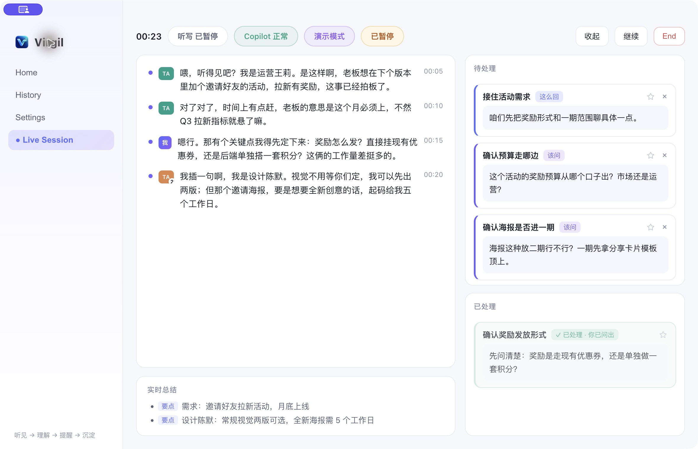

# Virgil

**Ask the missing question while the requirements discussion is still happening.**

Virgil is a macOS conversation copilot for product managers, developers, and small
teams. It transcribes a discussion, surfaces useful follow-up questions, suggests
short replies, and keeps searchable history with audio playback.

[Download the Apple Silicon alpha](https://github.com/Etan330/Virgil/releases/tag/v1.1.1-alpha.3) · [中文](README.md) · [Usage guide](docs/USAGE.md)

*Built-in scripted demo showing the interface and card interactions.*

## From a vague request to a useful question

Illustrative discussion:

> “Let's launch a referral campaign next release. There should be rewards.”

| Missing detail | A question you could ask |
| --- | --- |
| Reward mechanism affects implementation | “Are we reusing coupons or building a new points system?” |
| Scope affects delivery | “What needs to ship first, and what can wait?” |
| Success needs a concrete measure | “How many new users count as success?” |

Suggestions depend on the conversation. You choose what to ask, save, or ignore.

## What you can do

- **Keep a useful question in view.** Follow-up and reply cards sit beside the live transcript and discussion notes, or in a compact floating window.
- **Track what happened.** Cards distinguish a question you asked, an answer from a counterpart, and a reply you made.
- **Return to the original words.** Search history by keyword and click a transcript line to jump to its recording.

## Try it

1. Download the DMG and drag Virgil into Applications.
2. Choose **演示模式** on Home. The scripted demo needs no account or API key.
3. For live use, configure a Volcengine speech key and a GLM, DeepSeek, or SiliconFlow text-model key in Settings, test, and save.

The interface is primarily Chinese. Current builds support Apple Silicon Macs and
microphone capture, suited to in-person discussions. System audio from headset
calls is not captured. The alpha is ad-hoc signed, without Developer ID signing or
notarization; after checking the download's origin, allow first launch in macOS
Privacy & Security if needed.

Recordings and history stay on your Mac. Live audio goes to Volcengine and text
context goes to your chosen model provider. Keys are currently stored in plaintext
locally. Live provider usage may incur charges; verify important details against
the recording. [Setup and data details](docs/USAGE.md).

If this would help your requirements discussions, star the repository to follow
its progress. [Share a concrete use case](https://github.com/Etan330/Virgil/issues/new/choose) or contribute a focused improvement.

[Development](docs/DEVELOPMENT.md) · [Contributing](CONTRIBUTING.md) · [Validation record](docs/VALIDATION.md) · [MIT License](LICENSE)
