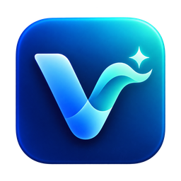

  

<h1 align="center">Virgil</h1>

<strong>需求讨论时，帮你问清还没对齐的事。</strong>

A real-time conversation copilot for requirements discussions on macOS.

  <a href="https://github.com/Etan330/Virgil/releases/tag/v1.1.1-alpha.3">下载 macOS 预览版</a> ·
  <a href="#start">先试免 Key 演示</a> ·
  <a href="docs/USAGE.md">使用指南</a> ·
  <a href="README.en.md">English</a>

  
  
  

会议里，大家很容易说出“下个版本做”“到时候上线”“效果要好一点”。真正影响落地的范围、日期和验收标准，却还没有问清。

Virgil 一边转录对话，一边提示值得追问的信息，给你一句可以参考着说出口的话。适合产品经理、研发和独立开发者，在当面的需求讨论中把事情聊具体。

*截图来自内置脚本演示，展示界面与卡片交互。*

## 看看它会帮你问什么

下面是一段需求讨论的示意：

> “下个版本做邀请好友活动，拉新有奖励，这个月要上线。”

| 还没对齐的信息 | 一句可以问出口的追问 |
| --- | --- |
| 奖励形式影响开发量 | “奖励用现有优惠券，还是要新做积分？” |
| 一期范围影响排期 | “哪些必须这个月上线，哪些可以放到二期？” |
| 验收标准还不具体 | “多少新用户算这次活动达标？” |

实际建议会根据当前对话生成。你决定问哪一句，也可以忽略或收藏卡片。

## 讨论中有提示，会后有原话

**需要追问时，补上关键信息。** 关注当前讨论的范围、负责人、时间、预算、验收和依赖，把值得问的点变成简短卡片。

**需要回应时，给一句参考。** 面对请求或分歧，参考建议继续澄清。卡片会区分“你已问出”“对方已回答”和“你已回应”，方便回看讨论进展。

**让提示留在视线里。** 实时转录、讨论要点和卡片同屏呈现；也可以收起为悬浮窗，边讨论边看。重要卡片可以收藏，不需要的可以忽略。

**会后回到原话。** 按关键词搜索历史会话，点击一条转录即可跳到录音对应位置。需要核对姓名、时间或承诺时，直接回听。

## 开始使用

1. [下载 Apple Silicon 预览版 DMG](https://github.com/Etan330/Virgil/releases/tag/v1.1.1-alpha.3)，把 **Virgil** 拖到 **Applications**。
2. 打开应用，点击 Home 右上角的 **演示模式**。不用注册、不用填 Key，即可看一次完整的脚本演示。
3. 准备开始真实讨论时，在 **Settings** 配置火山语音 Key，以及 GLM、DeepSeek 或硅基流动的文字模型 Key；测试并保存后，点击 **Start**。

[详细配置与声音登记 →](docs/USAGE.md)

macOS 首次打开提示无法验证开发者？

预览安装包采用 ad-hoc 签名，尚未做 Apple Developer ID 签名和公证。确认文件来自本仓库后，在系统设置 → 隐私与安全性中允许打开。Release 页面提供 SHA256SUMS.txt 校验和。

## 开始前，你可能想知道

**适合什么会议？** 当前支持 Apple Silicon Mac，界面主要为中文，采集麦克风声音，适合当面需求讨论。耳机线上会议的系统声音尚未采集。

**需要付费吗？** 源码按 MIT 开源；免 Key 演示可以直接体验。真实运行使用你自己的供应商 Key，费用和额度以供应商规则为准。

**数据保存在哪里？** 录音和会话历史保存在你的 Mac。实时音频发往火山语音，文字上下文发往你选择的模型服务；Key 当前在本机明文保存。[配置与数据说明 →](docs/USAGE.md)

## 一起把需求讨论做得更清楚

如果你也经常在会后发现“当时应该多问一句”，欢迎 **Star** 关注后续迭代。

试用后可以[反馈一个具体场景](https://github.com/Etan330/Virgil/issues/new/choose)：哪条提示帮到了你、哪条来得太早，或你希望它提醒哪种问题。

[开发指南](docs/DEVELOPMENT.md) · [贡献说明](CONTRIBUTING.md) · [实测记录](docs/VALIDATION.md) · [MIT License](LICENSE) · [第三方许可](THIRD_PARTY_NOTICES.md)
